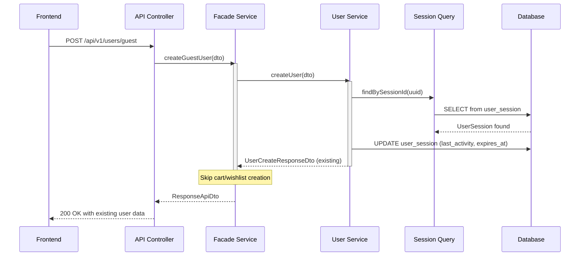
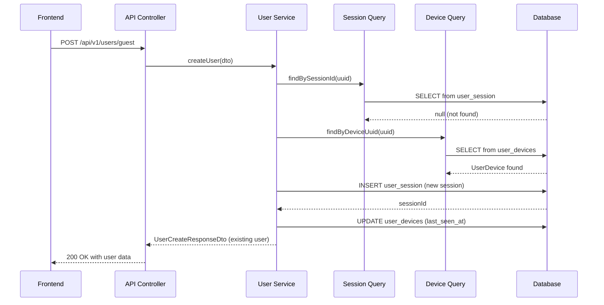

## 1. Goal

### Primary Objective
Enable automatic registration of first-time visitors as guest users to track user behavior and provide a seamless experience for e-commerce analytics tracking.

### Business Value
- **User Behavior Tracking**: Track anonymous users throughout their journey using a consistent `userId`
- **Session Continuity**: Maintain user context across multiple visits and devices
- **Analytics Foundation**: Build a foundation for conversion funnel analysis and user journey mapping
- **Future Personalization**: Enable personalized experiences even for unregistered users
- **Cart/Wishlist Persistence**: Allow guest users to maintain carts and wishlists across sessions

### Technical Goals
- Create a frictionless user identification system
- Establish a robust session management architecture
- Support multi-device tracking capabilities
- Enable seamless transition from guest to registered user

## 2. REST API and Its Requirements and Validation

### 2.1 API Endpoint

```http
POST /api/v1/users/guest
Content-Type: application/json
```

### 2.2 Request Structure

```json
{
  "sessionId": "550e8400-e29b-41d4-a716-446655440000",
  "deviceInfo": {
    "deviceType": "WEB",
    "deviceUuid": "660e8400-e29b-41d4-a716-446655440001",
    "deviceName": "Chrome on Windows",
    "osVersion": "Windows 10",
    "browserName": "Chrome",
    "browserVersion": "120.0.0",
    "screenWidth": 1920,
    "screenHeight": 1080,
    "screenDensity": 1.0,
    "pushToken": null
  },
  "ipAddress": "192.168.1.1"
}
```

### 2.3 Response Structure

```json
{
  "success": true,
  "data": {
    "userId": 12345,
    "sessionId": "550e8400-e29b-41d4-a716-446655440000",
    "userSessionId": 67890,
    "userDeviceId": 11111,
    "cartId": 22222,
    "wishlistId": 33333,
    "isNewUser": true
  },
  "timestamp": "2025-01-08T10:30:00Z"
}
```

### 2.4 Validation Rules

#### Request Validation
- **sessionId**: Required, UUID format, must be unique per active session
- **deviceInfo.deviceType**: Required, enum [WEB, IOS, ANDROID, TABLET]
- **deviceInfo.deviceUuid**: Required, UUID format
- **deviceInfo.deviceName**: Optional, max 100 chars
- **deviceInfo.osVersion**: Optional, max 50 chars
- **deviceInfo.browserName**: Optional, max 50 chars, required if deviceType=WEB
- **deviceInfo.browserVersion**: Optional, max 50 chars
- **deviceInfo.screenWidth**: Optional, positive integer
- **deviceInfo.screenHeight**: Optional, positive integer
- **deviceInfo.screenDensity**: Optional, decimal (0.5 - 4.0)
- **ipAddress**: Optional, valid IPv4 or IPv6 format

### 2.5 Error Responses

```json
// 400 Bad Request - Validation Error
{
  "success": false,
  "error": {
    "code": "VALIDATION_ERROR",
    "message": "Invalid request parameters",
    "details": [
      {
        "field": "sessionId",
        "message": "Invalid UUID format"
      }
    ]
  }
}

// 429 Too Many Requests - Rate Limit
{
  "success": false,
  "error": {
    "code": "RATE_LIMIT_EXCEEDED",
    "message": "Too many requests from this IP",
    "retryAfter": 60
  }
}

// 500 Internal Server Error
{
  "success": false,
  "error": {
    "code": "INTERNAL_ERROR",
    "message": "An unexpected error occurred",
    "traceId": "abc-123-def-456"
  }
}
```

## 3. Database Tables Design

### 3.1 Core Tables

#### users
```sql
CREATE TABLE users (
    id BIGSERIAL PRIMARY KEY,
    first_name VARCHAR(50),
    last_name VARCHAR(50),
    middle_name VARCHAR(50),
    birth_date DATE,
    role VARCHAR(20) NOT NULL DEFAULT 'GUEST',
    status VARCHAR(20) NOT NULL DEFAULT 'UNREGISTERED',
    avatar_url TEXT,
    created_at TIMESTAMP NOT NULL DEFAULT CURRENT_TIMESTAMP,
    updated_at TIMESTAMP,
    INDEX idx_users_role (role),
    INDEX idx_users_status (status),
    INDEX idx_users_created_at (created_at)
);
```

#### user_session
```sql
CREATE TABLE user_session (
    id BIGSERIAL PRIMARY KEY,
    session_id UUID UNIQUE NOT NULL,
    user_id BIGINT NOT NULL,
    user_device_id BIGINT,
    ip_address INET,
    created_at TIMESTAMP NOT NULL DEFAULT CURRENT_TIMESTAMP,
    last_activity_at TIMESTAMP NOT NULL,
    expires_at TIMESTAMP NOT NULL,
    status VARCHAR(20) NOT NULL DEFAULT 'ACTIVE',
    FOREIGN KEY (user_id) REFERENCES users(id),
    FOREIGN KEY (user_device_id) REFERENCES user_devices(id),
    INDEX idx_session_uuid (session_id),
    INDEX idx_session_user_id (user_id),
    INDEX idx_session_status_expires (status, expires_at),
    INDEX idx_session_last_activity (last_activity_at)
);
```

#### user_devices
```sql
CREATE TABLE user_devices (
    id BIGSERIAL PRIMARY KEY,
    user_id BIGINT NOT NULL,
    device_type VARCHAR(20) NOT NULL,
    device_uuid UUID UNIQUE,
    device_name VARCHAR(100),
    os_version VARCHAR(50),
    browser_name VARCHAR(50),
    browser_version VARCHAR(50),
    screen_width INTEGER,
    screen_height INTEGER,
    screen_density DECIMAL(4,2),
    push_token TEXT,
    last_seen_at TIMESTAMP,
    created_at TIMESTAMP NOT NULL DEFAULT CURRENT_TIMESTAMP,
    FOREIGN KEY (user_id) REFERENCES users(id),
    INDEX idx_devices_user_id (user_id),
    INDEX idx_devices_uuid (device_uuid),
    INDEX idx_devices_type (device_type),
    INDEX idx_devices_last_seen (last_seen_at)
);
```

## 4. Pseudocode

### 4.1 Controller Layer
```java
@RestController
@RequestMapping("/api/v1/users")
public class UserController {
    
    @PostMapping("/guest")
    @RateLimited(limit = 10, duration = 60) // 10 requests per minute per IP
    public ResponseEntity<UserCreateResponseApiDto> createGuestUser(
            @Valid @RequestBody UserCreateRequestApiDto request,
            HttpServletRequest httpRequest
    ) {
        
        // Extract IP address
        String ipAddress = extractIpAddress(httpRequest);
        request.setIpAddress(ipAddress);
        
        // Call facade service
        UserCreateResponseApiDto response = userCreateFacadeService
            .createGuestUser(request);
        
        return ResponseEntity.ok(response);
    }
}
```

### 4.2 Facade Service Layer
```java
@Service
@Slf4j
public class UserCreateFacadeService {
    
    @Transactional(
        isolation = Isolation.READ_COMMITTED,
        propagation = Propagation.REQUIRED,
        rollbackFor = Exception.class
    )
    public UserCreateResponseApiDto createGuestUser(
            UserCreateRequestApiDto apiDto) {
        
        try {
            // Step 1: Map API DTO to internal DTO
            UserCreateRequestDto requestDto = mapper.toInternalDto(apiDto);
            
            // Step 2: Create or retrieve user with session/device
            UserCreateResponseDto userResponse = userCreateService
                .createUser(requestDto);
            
            // Step 3: Create cart for the user
            // DO NOT IMPLEMENT. LAZY INIT IT WHEN USER ADDS AN ITEM
            //CartDto cart = cartCreateService
            //    .createCart(userResponse.getUserId());
            
            // Step 4: Create wishlist for the user
            // DO NOT IMPLEMENT. LAZY INIT IT WHEN USER ADDS AN ITEM
            //WishlistDto wishlist = wishlistCreateService
            //    .createWishlist(userResponse.getUserId());
            
            // Step 5: Build and return response
            return UserCreateResponseApiDto.builder()
                .userId(userResponse.getUserId())
                .sessionId(requestDto.getSessionId())
                .userSessionId(userResponse.getUserSessionId())
                .userDeviceId(userResponse.getUserDeviceId())
                //.cartId(cart.getId())
                //.wishlistId(wishlist.getId())
                .isNewUser(userResponse.isNewUser())
                .build();
                
        } catch (Exception e) {
            log.error("Failed to create guest user", e);
            throw new UserCreationException("Failed to create guest user", e);
        }
    }
}
```

### 4.3 Service Layer
```java
@Service
@Slf4j
public class UserCreateService {
    
    public UserCreateResponseDto createUser(UserCreateRequestDto dto) {
        
        // Step 1: Check if session already exists
        Optional<UserSession> existingSession = userSessionQueryService
            .findBySessionId(dto.getSessionId());
            
        if (existingSession.isPresent()) {
            // Session exists - return existing user
            UserSession session = existingSession.get();
            User user = session.getUser();
            
            // Update last activity
            session.setLastActivityAt(LocalDateTime.now());
            session.setExpiresAt(LocalDateTime.now().plusHours(24));
            userSessionRepository.save(session);
            
            return buildResponse(user, session, false);
        }
        
        // Step 2: Check if device exists
        Optional<UserDevice> existingDevice = userDeviceQueryService
            .findByDeviceUuid(dto.getDeviceInfo().getDeviceUuid());
            
        if (existingDevice.isPresent()) {
            // Device exists - create new session for existing user
            UserDevice device = existingDevice.get();
            User user = device.getUser();
            
            UserSession newSession = createSession(dto.getSessionId(), 
                user, device, dto.getIpAddress());
            
            return buildResponse(user, newSession, false);
        }
        
        // Step 3: Create new user, session, and device
        User newUser = createGuestUser();
        UserDevice newDevice = createDevice(dto.getDeviceInfo(), newUser);
        UserSession newSession = createSession(dto.getSessionId(), 
            newUser, newDevice, dto.getIpAddress());
        
        return buildResponse(newUser, newSession, true);
    }
    
    private User createGuestUser() {
        return userRepository.save(
            User.builder()
                .role(UserRole.GUEST)
                .status(UserStatus.UNREGISTERED)
                .build()
        );
    }
    
    private UserDevice createDevice(DeviceInfoDto deviceInfo, User user) {
        return userDeviceRepository.save(
            UserDevice.builder()
                .user(user)
                .deviceType(deviceInfo.getDeviceType())
                .deviceUuid(deviceInfo.getDeviceUuid())
                .deviceName(deviceInfo.getDeviceName())
                .osVersion(deviceInfo.getOsVersion())
                .browserName(deviceInfo.getBrowserName())
                .browserVersion(deviceInfo.getBrowserVersion())
                .screenWidth(deviceInfo.getScreenWidth())
                .screenHeight(deviceInfo.getScreenHeight())
                .screenDensity(deviceInfo.getScreenDensity())
                .lastSeenAt(LocalDateTime.now())
                .build()
        );
    }
    
    private UserSession createSession(UUID sessionId, User user, 
            UserDevice device, String ipAddress) {
        return userSessionRepository.save(
            UserSession.builder()
                .sessionId(sessionId)
                .user(user)
                .userDevice(device)
                .ipAddress(InetAddress.getByName(ipAddress))
                .status(SessionStatus.ACTIVE)
                .lastActivityAt(LocalDateTime.now())
                .expiresAt(LocalDateTime.now().plusHours(24))
                .build()
        );
    }
}
```

## 5. Sequence Diagrams

### 5.1 New User Registration Flow
```mermaid
sequenceDiagram
    participant UI as Frontend
    participant API as API Controller
    participant Facade as Facade Service
    participant UserSvc as User Service
    participant SessionQ as Session Query
    participant DeviceQ as Device Query
    participant DB as Database
    participant CartSvc as Cart Service
    participant WishSvc as Wishlist Service
    
    UI->>API: POST /api/v1/users/guest
    API->>API: Validate request
    API->>API: Extract IP address
    API->>Facade: createGuestUser(dto)
    
    activate Facade
    Note over Facade: Begin Transaction
    
    Facade->>UserSvc: createUser(dto)
    
    activate UserSvc
    UserSvc->>SessionQ: findBySessionId(uuid)
    SessionQ->>DB: SELECT from user_session
    DB-->>SessionQ: null (not found)
    
    UserSvc->>DeviceQ: findByDeviceUuid(uuid)
    DeviceQ->>DB: SELECT from user_devices
    DB-->>DeviceQ: null (not found)
    
    UserSvc->>DB: INSERT user (GUEST, UNREGISTERED)
    DB-->>UserSvc: userId
    
    UserSvc->>DB: INSERT user_device
    DB-->>UserSvc: deviceId
    
    UserSvc->>DB: INSERT user_session
    DB-->>UserSvc: sessionId
    
    UserSvc-->>Facade: UserCreateResponseDto
    deactivate UserSvc
    
    <DO NOT IMPLEMENT>Facade->>CartSvc: createCart(userId)
    <DO NOT IMPLEMENT>CartSvc->>DB: INSERT cart
    <DO NOT IMPLEMENT>DB-->>CartSvc: cartId
    <DO NOT IMPLEMENT>CartSvc-->>Facade: CartDto
    
    <DO NOT IMPLEMENT>Facade->>WishSvc: createWishlist(userId)
    <DO NOT IMPLEMENT>WishSvc->>DB: INSERT wishlist
    <DO NOT IMPLEMENT>DB-->>WishSvc: wishlistId
    <DO NOT IMPLEMENT>WishSvc-->>Facade: WishlistDto
    
    Note over Facade: Commit Transaction
    deactivate Facade
    
    Facade-->>API: ResponseApiDto
    API-->>UI: 200 OK with user data
```

### 5.2 Returning User with Existing Session


### 5.3 New Session for Existing Device


## 6. Monitoring and Alerts

### 6.1 Key Metrics

#### Application Metrics
```yaml
metrics:
  - name: guest_user_creation_total
    type: counter
    description: Total number of guest users created
    labels: [device_type, is_new_user]
    
  - name: guest_user_creation_duration_seconds
    type: histogram
    description: Time taken to create guest user
    buckets: [0.1, 0.5, 1, 2, 5]
    
  - name: guest_user_creation_errors_total
    type: counter
    description: Total number of errors during guest user creation
    labels: [error_type, step]
    
  - name: active_sessions_gauge
    type: gauge
    description: Current number of active sessions
    
  - name: device_registration_total
    type: counter
    description: Total devices registered
    labels: [device_type, os_version]
```

#### Database Metrics
```yaml
database_metrics:
  - name: db_transaction_duration_seconds
    type: histogram
    description: Database transaction duration
    
  - name: db_connection_pool_active
    type: gauge
    description: Active database connections
    
  - name: db_deadlocks_total
    type: counter
    description: Database deadlock occurrences
```

### 6.2 Alert Rules

```yaml
alerts:
  - name: HighGuestUserCreationErrorRate
    condition: rate(guest_user_creation_errors_total[5m]) > 0.1
    severity: warning
    description: "Error rate > 10% in guest user creation"
    
  - name: SlowGuestUserCreation
    condition: histogram_quantile(0.95, guest_user_creation_duration_seconds) > 2
    severity: warning
    description: "95th percentile response time > 2 seconds"
    
  - name: DatabaseTransactionFailure
    condition: rate(db_transaction_rollbacks_total[5m]) > 0.05
    severity: critical
    description: "Transaction rollback rate > 5%"
    
  - name: SessionExplosion
    condition: rate(active_sessions_gauge[1h]) > 10000
    severity: warning
    description: "Abnormal session growth detected"
    
  - name: DuplicateSessionDetected
    condition: duplicate_session_attempts_total > 100
    severity: info
    description: "High number of duplicate session attempts"
```

### 6.3 Logging Strategy

```java
@Slf4j
@Component
public class GuestUserAuditLogger {
    
    @EventListener
    public void onUserCreated(UserCreatedEvent event) {
        MDC.put("userId", event.getUserId());
        MDC.put("sessionId", event.getSessionId());
        MDC.put("deviceId", event.getDeviceId());
        MDC.put("traceId", event.getTraceId());
        
        log.info("Guest user created: userId={}, sessionId={}, deviceType={}, isNew={}",
            event.getUserId(), 
            event.getSessionId(),
            event.getDeviceType(),
            event.isNewUser());
            
        // Structured logging for analytics
        log.info(new StructuredArguments.kv("event", "guest_user_created"),
            new StructuredArguments.kv("user_id", event.getUserId()),
            new StructuredArguments.kv("session_id", event.getSessionId()),
            new StructuredArguments.kv("device_type", event.getDeviceType()),
            new StructuredArguments.kv("is_new_user", event.isNewUser()));
    }
}
```

## 7. Risks and Possible Problems

### 7.1 Technical Risks

| Risk                                 | Impact  | Probability | Mitigation                                                              |
|--------------------------------------|---------|-------------|-------------------------------------------------------------------------|
| **Database Deadlocks**               | High    | Medium      | Implement proper transaction isolation levels, ordered lock acquisition |
| **Session ID Collision**             | High    | Low         | Use UUID v4 with cryptographically secure random generator              |
| **Memory Leak from Session Storage** | High    | Medium      | Implement session cleanup job, set TTL on cache entries                 |
| **Race Conditions**                  | Medium  | High        | Use database constraints, optimistic locking, idempotency               |
| **Transaction Rollback Cascades**    | High    | Low         | Implement saga pattern for distributed transactions                     |
| **Device Fingerprinting Accuracy**   | Medium  | Medium      | Combine multiple device attributes, implement fuzzy matching            |

### 7.2 Security Risks

| Risk                        | Impact   | Mitigation                                                      |
|-----------------------------|----------|-----------------------------------------------------------------|
| **Session Hijacking**       | High     | Implement session validation, IP binding, device fingerprinting |
| **UUID Predictability**     | High     | Use cryptographically secure random generation                  |
| **DDoS via User Creation**  | High     | Implement rate limiting, CAPTCHA for suspicious patterns        |
| **Data Privacy Violations** | High     | Encrypt sensitive data, implement GDPR compliance               |
| **Cross-Device Tracking**   | Medium   | Implement user consent mechanisms                               |

### 7.3 Performance Risks

```yaml
performance_risks:
  - risk: Database Connection Pool Exhaustion
    cause: High concurrent user creation requests
    mitigation:
      - Configure appropriate pool size (min: 10, max: 30)
      - Implement connection timeout (30 seconds)
      - Use read replicas for query operations
      
  - risk: Transaction Lock Contention
    cause: Long-running transactions
    mitigation:
      - Keep transactions short
      - Use READ_COMMITTED isolation level
      - Implement retry mechanism with exponential backoff
      
  - risk: Memory Overflow
    cause: Unbounded session cache growth
    mitigation:
      - Implement LRU cache with max size
      - Set TTL on cache entries (24 hours)
      - Monitor memory usage metrics
```

## 8. Safety and Restrictions

### 8.1 Rate Limiting Configuration

```java
@Configuration
public class RateLimitConfig {
    
    @Bean
    public RateLimiter guestUserCreationRateLimiter() {
        return RateLimiter.of("guestUserCreation", 
            RateLimiterConfig.custom()
                .limitForPeriod(10) // 10 requests
                .limitRefreshPeriod(Duration.ofMinutes(1)) // per minute
                .timeoutDuration(Duration.ofSeconds(5)) // wait timeout
                .build());
    }
    
    @Bean
    public RateLimiter ipBasedRateLimiter() {
        return RateLimiter.of("ipBased",
            RateLimiterConfig.custom()
                .limitForPeriod(100) // 100 requests
                .limitRefreshPeriod(Duration.ofHours(1)) // per hour per IP
                .build());
    }
}
```

### 8.2 Data Validation Rules

```java
@Component
public class GuestUserValidator {
    
    public void validateSessionId(UUID sessionId) {
        // Check UUID version (should be v4)
        if (sessionId.version() != 4) {
            throw new ValidationException("Invalid UUID version");
        }
        
        // Check for reserved/test UUIDs
        if (isReservedUUID(sessionId)) {
            throw new ValidationException("Reserved UUID detected");
        }
    }
    
    public void validateDeviceInfo(DeviceInfoDto deviceInfo) {
        // Validate device type consistency
        if (deviceInfo.getDeviceType() == DeviceType.WEB) {
            if (StringUtils.isEmpty(deviceInfo.getBrowserName())) {
                throw new ValidationException("Browser name required for WEB device");
            }
        }
        
        // Validate screen dimensions
        if (deviceInfo.getScreenWidth() != null) {
            if (deviceInfo.getScreenWidth() < 320 || 
                deviceInfo.getScreenWidth() > 7680) {
                throw new ValidationException("Invalid screen width");
            }
        }
        
        // Validate screen density
        if (deviceInfo.getScreenDensity() != null) {
            if (deviceInfo.getScreenDensity().compareTo(BigDecimal.valueOf(0.5)) < 0 ||
                deviceInfo.getScreenDensity().compareTo(BigDecimal.valueOf(4.0)) > 0) {
                throw new ValidationException("Invalid screen density");
            }
        }
    }
}
```

### 8.3 Security Constraints

```yaml
security_constraints:
  session_management:
    - max_sessions_per_device: 5
    - session_timeout_hours: 24
    - idle_timeout_minutes: 30
    - concurrent_sessions_allowed: true
    
  device_management:
    - max_devices_per_user: 10
    - device_trust_score_threshold: 0.7
    - require_device_verification: false
    
  data_protection:
    - encrypt_session_tokens: true
    - hash_device_fingerprints: true
    - anonymize_ip_addresses: true
    - retention_period_days: 90
```

### 8.4 Cleanup and Maintenance

```java
@Component
@Slf4j
public class SessionCleanupJob {
    
    @Scheduled(cron = "0 0 */6 * * *") // Every 6 hours
    public void cleanupExpiredSessions() {
        int deleted = userSessionRepository
            .deleteByStatusAndExpiresAtBefore(
                SessionStatus.ACTIVE, 
                LocalDateTime.now()
            );
        log.info("Cleaned up {} expired sessions", deleted);
    }
    
    @Scheduled(cron = "0 0 2 * * *") // Daily at 2 AM
    public void cleanupOrphanedCarts() {
        int deleted = cartRepository
            .deleteOrphanedCarts(LocalDateTime.now().minusDays(30));
        log.info("Cleaned up {} orphaned carts", deleted);
    }
    
    @Scheduled(cron = "0 0 3 * * SUN") // Weekly on Sunday at 3 AM
    public void archiveOldGuestUsers() {
        int archived = userArchiveService
            .archiveInactiveGuestUsers(LocalDateTime.now().minusDays(90));
        log.info("Archived {} inactive guest users", archived);
    }
}
```

## 9. Acceptance Criteria

### 9.1 Functional Requirements

✅ **Guest User Creation**
- [ ] System creates a new guest user when receiving first request with unknown session/device
- [ ] Guest user has role=GUEST and status=UNREGISTERED
- [ ] User ID is generated and returned in response

✅ **Session Management**
- [ ] New session is created for first-time visitors
- [ ] Existing sessions are recognized and reused
- [ ] Session expires after 24 hours of inactivity
- [ ] Session last_activity_at is updated on each request

✅ **Device Tracking**
- [ ] Device information is stored on first visit
- [ ] Same device is recognized on subsequent visits
- [ ] Multiple sessions can be associated with one device
- [ ] Device last_seen_at is updated on activity

✅ **Cart and Wishlist**
- [ ] Cart is automatically created for new guest users when it adds first item.
- [ ] Wishlist is automatically created for new guest users when it adds first item.
- [ ] Cart and wishlist IDs are returned in response
- [ ] Existing users don't get duplicate carts/wishlists

### 9.2 Non-Functional Requirements

✅ **Performance**
- [ ] Response time < 500ms for 95th percentile
- [ ] Response time < 1000ms for 99th percentile
- [ ] Support 1000 concurrent requests
- [ ] Database query time < 100ms

✅ **Reliability**
- [ ] 99.9% uptime for the service
- [ ] Automatic retry with exponential backoff
- [ ] Circuit breaker for downstream services
- [ ] Graceful degradation on partial failures

✅ **Security**
- [ ] Rate limiting: 10 requests/minute per IP
- [ ] Session tokens use secure random generation
- [ ] No PII exposed in logs
- [ ] GDPR compliant data handling

✅ **Monitoring**
- [ ] All requests are logged with trace ID
- [ ] Metrics exposed for Prometheus
- [ ] Alerts configured for error rates > 1%
- [ ] Dashboard shows real-time user creation rate

### 9.3 Testing Requirements

```gherkin
Feature: Automatic Guest User Registration

  Scenario: First-time visitor creates guest user
    Given a new visitor with no existing session
    When they access the website
    Then a guest user should be created
    And a session should be established
    And a cart should be created
    And a wishlist should be created
    And the response should include all IDs
    
  Scenario: Returning visitor with active session
    Given a visitor with an active session
    When they return to the website
    Then their existing user should be retrieved
    And the session should be updated
    And no new cart or wishlist should be created
    
  Scenario: Same device with new session
    Given a device that was previously used
    When a new session is initiated
    Then the existing user should be found
    And a new session should be created
    And the device last_seen should be updated
    
  Scenario: Rate limiting prevents abuse
    Given an IP address
    When more than 10 requests are made in 1 minute
    Then subsequent requests should be rejected with 429
    And an appropriate retry-after header should be set
```

### 9.4 Definition of Done

- [ ] Code implemented according to design
- [ ] Unit tests coverage > 80%
- [ ] Integration tests for all scenarios
- [ ] Performance tests pass SLA requirements
- [ ] Security scan shows no critical vulnerabilities
- [ ] Code reviewed and approved by 2 developers
- [ ] Documentation updated (API docs, README)
- [ ] Monitoring dashboards configured
- [ ] Alerts configured and tested
- [ ] Deployed to staging environment
- [ ] Acceptance tests pass in staging
- [ ] Product owner approval received
- [ ] Deployed to production with feature flag
- [ ] Post-deployment verification completed

## Summary

This analytics document provides a comprehensive blueprint for implementing automatic guest user registration. The system is designed to be:

- **Scalable**: Handles high concurrent loads with proper rate limiting
- **Reliable**: Implements transaction management and error handling
- **Secure**: Uses cryptographically secure UUIDs and rate limiting
- **Maintainable**: Clear separation of concerns with proper logging and monitoring
- **Performant**: Optimized database queries with proper indexing