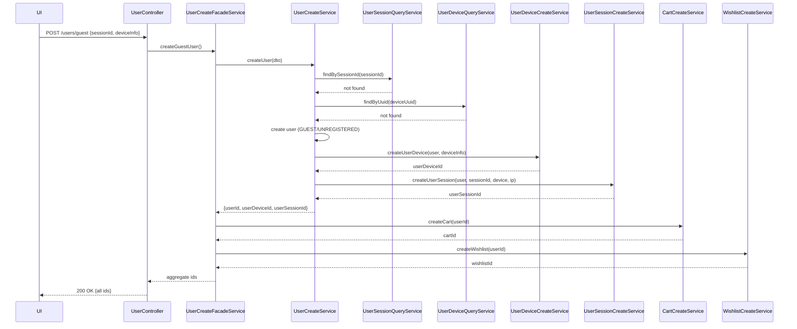
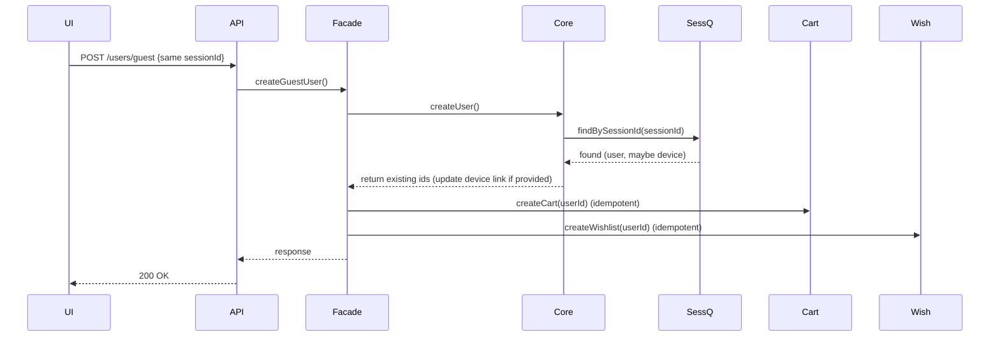
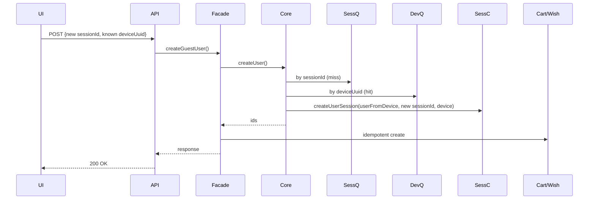

# Auto-Register Guests on First Visit - Technical Analysis

Here's your properly formatted technical analysis for the "auto-register guests on first visit" story:

## 1. Goal

### Business Objective
Automatically create a guest user (`role=GUEST`, `status=UNREGISTERED`) for every first-time visitor so their behavior 
    is trackable via a stable userId, and they immediately get a cart and wishlist.

### Technical Objective
Idempotent, low-latency API that:
- Creates/links User, UserSession, UserDevice
- Creates Cart and Wishlist
- Is safe under retries, concurrency, and partial failures
- Respects privacy & consent constraints

## 2. REST API

### Endpoint
- **POST** `/api/v1/users/guest`
- **Purpose**: Create or fetch guest context: userId, userSessionId, userDeviceId, cartId, wishlistId

### Headers
- `X-Request-Id` (optional but recommended for tracing)
- `X-Forwarded-For` / `CF-Connecting-IP` (if behind proxy; used for IP)
- `User-Agent` (fallback device info)

### Request (JSON)
```json
{
  "sessionId": "7d71a0a2-6a1a-4d3b-a25b-2cd9d979e0dd",
  "device": {
    "deviceType": "WEB",              // WEB | ANDROID | IOS | TABLET | OTHER
    "deviceUuid": "3a0c2c9e-8d4b-4b16-9d01-3c9cda007b3e", // optional but recommended
    "deviceName": "MacBook Pro",      // optional
    "osVersion": "macOS 14.5",        // optional
    "browserName": "Chrome",          // optional
    "browserVersion": "126.0.0",      // optional
    "screenWidth": 1440,              // optional
    "screenHeight": 900,              // optional
    "screenDensity": 2.00,            // optional
    "pushToken": null                 // optional
  }
}
```

### Validation
- **sessionId**: required, UUID (v4 format acceptable)
- **device.deviceType**: required, enum
- **device.deviceUuid**: optional UUID, unique if provided
- **Numeric fields**: positive integers / valid decimal for density
- **Payload size**: reject payloads > 16KB
- **Idempotency**: Same sessionId → return existing mapping (no duplicates)

### Security
- CORS allowlist for your web/app origins
- No auth required (guest creation), but throttle per IP+User-Agent to prevent abuse
- Sanitize strings (length limits), ignore unknown fields

### Responses

#### 200 OK (created or found)
```json
{
  "userId": 12345,
  "userSessionId": 67890,
  "userDeviceId": 24680,
  "cartId": 112233,
  "wishlistId": 445566,
  "role": "GUEST",
  "status": "UNREGISTERED",
  "sessionExpiresAt": "2025-08-09T12:34:56Z"
}
```

#### Error Responses
- **400**: Invalid UUID, missing required fields, invalid enum
- **409**: Device UUID uniqueness conflict (rare race) — client may retry with same payload
- **429**: Rate limited (too many creations from the same IP/device)
- **500**: Server error (log with X-Request-Id)

## 3. Database Tables (DDL)

Assumes PostgreSQL. Uses your entities + cart/wishlist.

```sql
-- users
CREATE TABLE users (
    id BIGSERIAL PRIMARY KEY,
    first_name VARCHAR(50),
    last_name VARCHAR(50),
    middle_name VARCHAR(50),
    birth_date DATE,
    role VARCHAR(20) NOT NULL DEFAULT 'GUEST',
    status VARCHAR(20) NOT NULL DEFAULT 'UNREGISTERED',
    avatar_url TEXT,
    created_at TIMESTAMPTZ NOT NULL DEFAULT now(),
    updated_at TIMESTAMPTZ
);
CREATE INDEX idx_users_role ON users(role);
CREATE INDEX idx_users_status ON users(status);

-- user_devices
CREATE TABLE user_devices (
    id BIGSERIAL PRIMARY KEY,
    user_id BIGINT NOT NULL REFERENCES users(id),
    device_type VARCHAR(20) NOT NULL,
    device_uuid UUID UNIQUE,                 -- nullable but unique if present
    device_name VARCHAR(100),
    os_version VARCHAR(50),
    browser_name VARCHAR(50),
    browser_version VARCHAR(50),
    screen_width INT,
    screen_height INT,
    screen_density NUMERIC(4,2),
    push_token TEXT,
    last_seen_at TIMESTAMPTZ,
    created_at TIMESTAMPTZ NOT NULL DEFAULT now()
);
CREATE INDEX idx_user_devices_user_id ON user_devices(user_id);
CREATE INDEX idx_user_devices_device_type ON user_devices(device_type);

-- user_session
CREATE TABLE user_session (
    id BIGSERIAL PRIMARY KEY,
    session_id UUID NOT NULL UNIQUE,
    user_id BIGINT NOT NULL REFERENCES users(id),
    user_device_id BIGINT REFERENCES user_devices(id),
    ip_address INET,
    created_at TIMESTAMPTZ NOT NULL DEFAULT now(),
    last_activity_at TIMESTAMPTZ NOT NULL DEFAULT now(),
    expires_at TIMESTAMPTZ NOT NULL,
    status VARCHAR(20) NOT NULL DEFAULT 'ACTIVE'
);
CREATE INDEX idx_user_session_user_id ON user_session(user_id);
CREATE INDEX idx_user_session_device_id ON user_session(user_device_id);
CREATE INDEX idx_user_session_status ON user_session(status);

-- carts (one active cart per user)
CREATE TABLE carts (
    id BIGSERIAL PRIMARY KEY,
    user_id BIGINT NOT NULL REFERENCES users(id),
    status VARCHAR(20) NOT NULL DEFAULT 'ACTIVE',
    created_at TIMESTAMPTZ NOT NULL DEFAULT now()
);
CREATE UNIQUE INDEX uidx_carts_user_active ON carts(user_id) WHERE (status = 'ACTIVE');

-- wishlists (one per user)
CREATE TABLE wishlists (
    id BIGSERIAL PRIMARY KEY,
    user_id BIGINT NOT NULL UNIQUE REFERENCES users(id),
    created_at TIMESTAMPTZ NOT NULL DEFAULT now()
);
```

### Constraints & Notes
- `user_session.session_id UNIQUE` → idempotency
- `user_devices.device_uuid UNIQUE` if provided → dedupe device rows
- Consider partial unique "one active session per session_id" is already covered by unique key
- Add FK `ON DELETE SET NULL` for `user_session.user_device_id` (if devices are purged)
- Store IP as `INET` (your entity does that)
- Be mindful: your `@PrePersist` uses `createdAt` before it's set—see Risks §7

## 4. Pseudocode (Core Flow)

```java
// Controller
POST /api/v1/users/guest
validate(request)
response = userCreateFacadeService.createGuestUser(request)
return 200 OK with response

// Facade (transactional)
createGuestUser(apiRequest):
    dto = mapToUserCreateRequestDto(apiRequest.sessionId, apiRequest.device, clientIp)
    userResp = userCreateService.createUser(dto)  // returns userId, sessionId, deviceId
    cartId = cartCreateService.createCart(userResp.userId)          // idempotent (one active per user)
    wishlistId = wishlistCreateService.createWishlist(userResp.userId) // idempotent (one per user)
    return buildApiResponse(userResp + cartId + wishlistId)

// UserCreateService (transactional)
createUser(dto):
    // 1) Idempotency by session
    existingSession = userSessionQueryService.findBySessionId(dto.sessionId)
    if existingSession exists:
        user = existingSession.user
        // align/update device if needed
        if dto.device.deviceUuid provided:
            device = userDeviceQueryService.findByUuid(dto.device.deviceUuid)
            if device not found:
                device = userDeviceCreateService.createForUser(user, dto.device)
            linkSessionToDevice(existingSession, device)
        return build(userId=user.id, userSessionId=existingSession.id, userDeviceId=device?.id)

    // 2) No session: try by deviceUuid
    device = null
    if dto.device.deviceUuid provided:
        device = userDeviceQueryService.findByUuid(dto.device.deviceUuid)
        if device exists:
            user = device.user
            session = userSessionCreateService.createForUser(user, dto.sessionId, device, dto.ip)
            return build(user.id, session.id, device.id)

    // 3) Nothing found: create all
    user = userRepository.save(User(role=GUEST, status=UNREGISTERED))
    device = userDeviceCreateService.createForUser(user, dto.device)
    session = userSessionCreateService.createForUser(user, dto.sessionId, device, dto.ip)
    return build(user.id, session.id, device.id)

// UserSessionCreateService
createForUser(user, sessionId, device, ip):
    try:
        return userSessionRepository.insertUnique(sessionId, user.id, device?.id, ip, expiresAt=now+24h)
    catch UniqueViolation on session_id:
        return userSessionQueryService.findBySessionId(sessionId)
```

### Idempotency Rules
- **Primary key**: sessionId (unique)
- **Secondary**: deviceUuid dedupes devices
- `createCart` & `createWishlist` must be idempotent: if record exists → return existing id

### Concurrency
- Use DB unique constraints + catch/retry instead of app locks
- Use SERIALIZABLE only if necessary; usually READ COMMITTED with unique keys suffices

## 5. Sequence Diagrams

### A. First-time visitor (new session, new device)


### B. Returning with the same sessionId


### C. New session on known device


## 6. Monitoring & Alerts

### Metrics (Prometheus/OpenTelemetry)
**API Metrics:**
- `request_count{endpoint="/users/guest"}`
- `latency_ms_p95`
- `error_rate`
- `status_code_count`

**Business Metrics:**
- `guest_user_created_count`
- `session_created_count`, `session_conflict_count` (unique violation)
- `device_created_count`, `device_dedup_hit_count`
- `cart_created_count`, `wishlist_created_count`
- Ratio: sessions per device, guests per day, guest→registered conversion (later)

**Database Metrics:**
- `deadlock_count`
- `unique_violation_count`

**Queues/Outbox (if used):**
- `pending_events`
- `retry_count`

### Logs
- Structured JSON with sessionId, deviceUuid, userId, requestId
- Log "path of resolution": bySession, byDevice, freshCreate
- Log conflicts and retries at WARN

### Alerts
- High 5xx or error_rate > 1% for 5 min
- latency_p95 > 300ms for 10 min
- Spike in unique_violation_count(session_id) → suspect retries/flood
- cart/wishlist creation failures (non-zero for 5 min)
- Abnormally high guest_user_created_count from same IP range → possible bot

### SLOs
- Availability 99.9% monthly
- p95 latency ≤ 250ms

## 7. Risks & Possible Problems

- **Entity lifecycle bug**: In UserSession, `@PrePersist` uses `this.createdAt.plusHours(24)` but `createdAt` is set by `@CreationTimestamp` at flush time — it can be null in `@PrePersist`. Use `now()` to compute `expiresAt`, or a DB default (`now() + interval '24 hours'`).

- **Privacy/compliance**: Automatic user creation = tracking. GDPR/ePrivacy require lawful basis (legitimate interest) and consent for certain tracking (esp. device identifiers). Provide a consent banner; avoid setting long-lived identifiers before consent where required.

- **Abuse/DDOS**: Endpoint can be spammed to inflate users/sessions. Add rate limiting per IP/device and bot filtering.

- **Device identification**: `deviceUuid` must be stable (cookie/localStorage) but revocable. Users clearing storage will create new devices.

- **Merging identities**: When a guest later registers/logs in, you must merge carts/wishlists/sessions reliably (not in scope here).

- **Partial failures**: Cart/wishlist services failing inside the same transaction can cause rollbacks or long transactions. Consider post-commit creation (outbox/event) or retries.

- **Concurrency**: Simultaneous calls with same sessionId or deviceUuid. Rely on DB unique constraints + catch & fetch.

- **Storage growth**: Many UNREGISTERED users accumulating. Add retention policy (e.g., purge inactive > 180 days).

- **Legal on IP**: IP address is personal data in many jurisdictions; store with justification and retention limits.

## 8. Safety & Restrictions

### Data Protection
- **Data minimization**: Store only what's needed (no PII at guest creation)
- **Consent**: If required, defer setting long-lived deviceUuid until consent. Until then, operate with session-only tracking
- **Opt-out**: Provide API to delete guest profile & data; honor "Do Not Track" if policy requires

### Security
- CORS allowlist, strict content-type checks, input size limits
- No elevation: role fixed to GUEST, status UNREGISTERED
- Encrypt at rest, TLS in transit

### Retention
- Expire sessions after 24h (as you do) and purge expired sessions periodically
- Purge old UNREGISTERED users/devices per policy

### Rate Limiting
- e.g., 30 requests / 5 min per IP; 10 / min per deviceUuid

## 9. Acceptance Criteria

### Functional
1. First visit with new sessionId & new deviceUuid → 200 with new userId, userSessionId, userDeviceId, and new cartId, wishlistId
2. Idempotent: Re-POST with same sessionId returns the same userId and does not create duplicates (verify by DB counts)
3. Known device + new sessionId → existing user & device reused; new session created and linked
4. No deviceUuid provided → flow still creates user & session; a device row is created only if rules say so (or create a device with null UUID)
5. Cart & wishlist are created once per user (idempotent): second call returns existing IDs
6. Validation: Invalid UUID or deviceType → 400 with error details
7. Rate limit breach → 429
8. Conflict on deviceUuid concurrent creates → one succeeds, others 409 or retry path returns existing device
9. Session expiry is ~24h from creation; lastActivityAt updates on subsequent updates/heartbeats
10. Logging/metrics present for each path (bySession/byDevice/freshCreate)

### Non-functional
1. p95 latency ≤ 250ms under nominal load
2. Error rate  16KB
5. Privacy: If consent is required in your region, deviceUuid isn't persisted until consent is granted; otherwise it is but with retention policy documented

## 10. Implementation Notes

### Fix UserSession timestamps:
```java
@PrePersist
protected void onCreate() {
    var now = LocalDateTime.now();
    this.lastActivityAt = now;
    this.expiresAt = now.plusHours(24);
}

@PreUpdate
protected void onUpdate() {
    var now = LocalDateTime.now();
    this.lastActivityAt = now;
    this.expiresAt = now.plusHours(24);
}
```

### Additional Recommendations
- Ensure `session_id` is unique in DB and also consider a natural id in JPA to shortcut lookups
- Make `CartCreateService.createCart(userId)` and `WishlistCreateService.createWishlist(userId)` upserts (e.g., `ON CONFLICT DO NOTHING RETURNING id` or fetch-or-create)
- Consider moving cart/wishlist creation to post-commit via an outbox to keep the main transaction lean