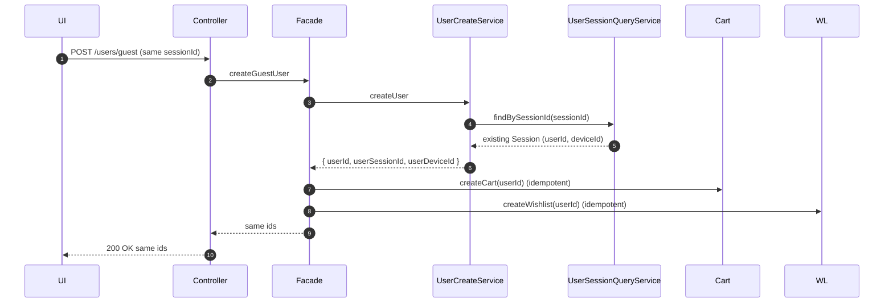
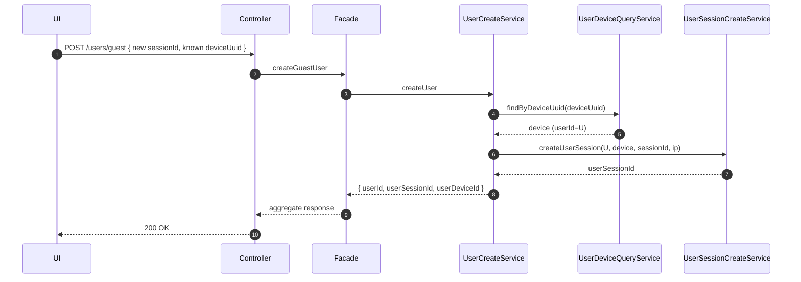

# Auto-Register Guests on First Visit - Technical Specification

## 1. Goal

**Auto-register every first-time visitor** as a guest user to enable long-term behavior tracking by a stable userId. On first page load, the UI sends a sessionId (UUID) and device info to the backend. 

Backend:
- Resolves/creates: User (GUEST, UNREGISTERED), UserSession, UserDevice
- Creates: Cart, Wishlist for that user
- Returns all created/linked IDs

**Key non-functional goals**: 
idempotency, 
low latency (p95 >Controller: POST /api/v1/users/guest { sessionId, device, ip } , high availability, privacy-safe & compliant.

2) REST API (+ requirements & validation)
   Endpoint
   POST /api/v1/users/guest
   Request (JSON)
   {
   "sessionId": "c07ab8f5-3c0a-4281-9c72-2f2b993a1e2b",
   "device": {
   "deviceType": "WEB|MOBILE_IOS|MOBILE_ANDROID|TABLET|BOT",
   "deviceUuid": "6ae1b7b6-2a56-4c1f-9a1e-7b21a50f3c1c",
   "deviceName": "MacBookPro16,2",
   "osVersion": "macOS 14.5",
   "browserName": "Chrome",
   "browserVersion": "126.0.0.0",
   "screenWidth": 2560,
   "screenHeight": 1600,
   "screenDensity": 2.0,
   "pushToken": null
   },
   "ip": "203.0.113.10"
   }
   Validation
   • sessionId: required, UUID, must be unique (idempotency).
   • device.deviceType: required, enum.
   • device.deviceUuid: optional but recommended; if present must be UUID and unique per device; duplicate binds to same device record.
   • deviceName/osVersion/browser*: optional, max lengths (name 100, versions 50).
   • screenWidth/Height: optional, positive ints; screenDensity: 0.5–8.0.
   • ip: optional; if present valid IPv4/IPv6.
   • Payload size limit: 16KB.
   Idempotency
   • sessionId is unique in user_session.session_id.
   • If same sessionId posted again → 200 OK returning the same IDs (no new writes).
   Responses
   200 OK
   {
   "userId": 12345,
   "userSessionId": 56789,
   "userDeviceId": 333,
   "cartId": 444,
   "wishlistId": 555,
   "role": "GUEST",
   "status": "UNREGISTERED"
   }
   400 invalid input; 409 if uniqueness conflict on deviceUuid with different user linkage and cannot reconcile; 429 rate-limited; 500 unexpected.
   Headers / Security
   • Accept X-Request-Id for tracing.
   • Auth: public endpoint (no token) but WAF + IP throttling.
   • CORS: allow site origins; deny wildcards in prod.
   • Set tracking cookie from UI separately (out of scope).
   Rate limits
   • 10 req/min per IP + user-agent burst; configurable.

3) Database tables design
   users
   • id BIGSERIAL PK
   • first_name varchar(50) NULL
   • last_name varchar(50) NULL
   • middle_name varchar(50) NULL
   • birth_date date NULL
   • role enum → default GUEST
   • status enum → default UNREGISTERED
   • avatar_url text NULL
   • created_at timestamptz not null default now()
   • updated_at timestamptz not null default now()
   • Indexes: idx_users_role_status (role, status)
   user_devices
   • id BIGSERIAL PK
   • user_id bigint not null FK → users(id) ON DELETE CASCADE
   • device_type enum not null
   • device_uuid uuid UNIQUE NULL (nullable allows browsers that block identifiers)
   • device_name varchar(100) NULL
   • os_version varchar(50) NULL
   • browser_name varchar(50) NULL
   • browser_version varchar(50) NULL
   • screen_width int NULL
   • screen_height int NULL
   • screen_density numeric(4,2) NULL
   • push_token text NULL
   • last_seen_at timestamptz NULL
   • created_at timestamptz not null default now()
   • Indexes: idx_user_devices_user_id, idx_user_devices_uuid_notnull (partial unique on device_uuid IS NOT NULL)
   user_session
   • id BIGSERIAL PK
   • session_id uuid UNIQUE NOT NULL
   • user_id bigint not null FK → users(id) ON DELETE CASCADE
   • user_device_id bigint NULL FK → user_devices(id) ON DELETE SET NULL
   • ip_address inet NULL
   • created_at timestamptz not null default now()
   • last_activity_at timestamptz not null
   • expires_at timestamptz not null
   • status enum default ACTIVE
   • Indexes: idx_user_session_user_id, idx_user_session_device_id, idx_user_session_expires_at
   carts
   • id BIGSERIAL PK
   • user_id bigint UNIQUE not null FK → users(id) ON DELETE CASCADE
   • created_at timestamptz default now()
   wishlists
   • id BIGSERIAL PK
   • user_id bigint UNIQUE not null FK → users(id) ON DELETE CASCADE
   • created_at timestamptz default now()
   Notes / fixes vs. code:

• In your UserSession#onCreate(), expires_at = this.created_at.plusHours(24) can be NULL because @CreationTimestamp is applied after persist. Use now = LocalDateTime.now() for both created_at (if null) and derived fields, or database defaults.
• Consider partial unique on (device_uuid) where not null (shown above).
• Ensure session_id unique constraint exists (idempotency).

4) Pseudocode (services & flow)
   // Controller
   POST /users/guest:
   validate(request)
   dto = mapToUserCreateRequestDto(request) // sessionId, deviceInfo, ip
   resp = userCreateFacadeService.createGuestUser(dto)
   return 200 resp

// Facade (Transactional)
createGuestUser(dto):
userResp = userCreateService.createUser(dto) // returns userId, userSessionId, userDeviceId
cartId = cartCreateService.createCart(userResp.userId) // idempotent: upsert-or-ignore
wishlistId = wishlistCreateService.createWishlist(userResp.userId) // idempotent
return buildApiResponse(userResp, cartId, wishlistId)

// Core
UserCreateService.createUser(dto):
// Step 1: Idempotency by session
existingSession = userSessionQueryService.findBySessionId(dto.sessionId)
if (existingSession != null):
user = existingSession.getUser()
device = ensureDeviceBinding(user, dto.device) // create if needed or update last_seen
// No new session for same sessionId
return compose(user.id, existingSession.id, device.id)

// Step 2: Reuse device if known
device = userDeviceQueryService.findByDeviceUuid(dto.device.deviceUuid)
if (device != null):
user = device.getUser()
else:
user = userQueryService.createGuestUser() // role=GUEST, status=UNREGISTERED
device = userDeviceCreateService.createUserDevice(user, dto.device)

// Step 3: Create session (unique by sessionId)
session = userSessionCreateService.createUserSession(user, device, dto.sessionId, dto.ip)

return compose(user.id, session.id, device.id)

// Helpers
ensureDeviceBinding(user, deviceDto):
if (deviceDto.deviceUuid == null) return userDeviceCreateService.createUserDevice(user, deviceDto)
existing = userDeviceQueryService.findByDeviceUuid(deviceDto.deviceUuid)
if (existing == null) return userDeviceCreateService.createUserDevice(user, deviceDto)
if (!existing.userId.equals(user.id)):
// conflict: same deviceUuid tied to a different user
// business choice: rebind? deny? log + 409? For guests, prefer keep-old and create new device without UUID.
return existing
userDeviceCreateService.updateSeen(existing, deviceDto)
return existing
Idempotent helpers:
• cartCreateService.createCart(userId) → INSERT … ON CONFLICT (user_id) DO NOTHING returning id (or select existing).
• Same for wishlist.

5) Sequence diagrams
   A) First-ever visit (no session, unknown device)
   sequenceDiagram
   autonumber
   participant UI
   participant Controller
   participant Facade
   participant UserCreateService as UserCreateService
   participant SessionQ as UserSessionQueryService
   participant DeviceQ as UserDeviceQueryService
   participant UserRepo as UserRepo
   participant DeviceC as UserDeviceCreateService
   participant SessionC as UserSessionCreateService
   participant Cart as CartCreateService
   participant WL as WishlistCreateService

UI->>Controller: POST /users/guest {sessionId, device, ip}
Controller->>Facade: createGuestUser(dto)
Facade->>UserCreateService: createUser(dto)
UserCreateService->>SessionQ: findBySessionId(sessionId)
SessionQ-->>UserCreateService: null
UserCreateService->>DeviceQ: findByDeviceUuid(deviceUuid)
DeviceQ-->>UserCreateService: null
UserCreateService->>UserRepo: create guest user
UserRepo-->>UserCreateService: userId
UserCreateService->>DeviceC: createUserDevice(userId, device)
DeviceC-->>UserCreateService: userDeviceId
UserCreateService->>SessionC: createUserSession(userId, userDeviceId, sessionId, ip)
SessionC-->>UserCreateService: userSessionId
UserCreateService-->>Facade: {userId, userSessionId, userDeviceId}
Facade->>Cart: createCart(userId)
Cart-->>Facade: cartId
Facade->>WL: createWishlist(userId)

```
Controller->>Facade: createGuestUser(dto)
Facade->>U: createUser(dto)
U->>SessionQ: findBySessionId(sessionId)
SessionQ-->>U: null
U->>DeviceQ: findByDeviceUuid(deviceUuid)
DeviceQ-->>U: null
U->>UserRepo: create guest User (role=GUEST, status=UNREGISTERED)
UserRepo-->>U: userId
U->>DeviceC: createUserDevice(userId, device)
DeviceC-->>U: userDeviceId
U->>SessionC: createUserSession(userId, userDeviceId, sessionId, ip)
SessionC-->>U: userSessionId
U-->>Facade: { userId, userSessionId, userDeviceId }
Facade->>Cart: createCart(userId)
Cart-->>Facade: cartId
Facade->>WL: createWishlist(userId)
WL-->>Facade: wishlistId
Facade-->>Controller: aggregate { ids... }
Controller-->>UI: 200 OK { ids... }
```

### B) Repeat call with SAME sessionId (idempotent)


### C) Known deviceUuid, new session


### D) Decision logic flowchart
```mermaid
flowchart TD
  A[Start: DTO {sessionId, device, ip}] --> B{sessionId exists?}
  B -- yes --> B1[Fetch session -> user, device] --> R[Return ids]
  B -- no --> C{deviceUuid provided?}
  C -- no --> U1[Create guest User] --> D1[Create Device (no UUID)] --> E1[Create Session] --> R
  C -- yes --> D{deviceUuid found?}
  D -- yes --> E[Get user from device] --> F[Create Session] --> R
  D -- no --> U2[Create guest User] --> D2[Create Device with UUID] --> F2[Create Session] --> R
```

## 6. Monitoring & Alerts

### Metrics (Prometheus/OpenTelemetry)
- `guest_create_requests_total`, `guest_create_requests_failed_total` (by error code)
- Latency histograms (p50/p95/p99) per component (controller, facade, each service)
- **DB**: conflicts on `user_session.session_id` (idempotency hits), conflicts on `device_uuid`
- **Counts**: users created, sessions created, devices created/updated
- Queue/DB connection pool saturation, retries
- Cart/Wishlist creation failures per user creation

### Logs
- Correlate with `X-Request-Id`, include `sessionId` hash (never raw if considered PII)
- Structured JSON; INFO for success, WARN on conflicts, ERROR on failures

### Dashboards
- **Funnel**: calls → user created? → session created → device bound → cart → wishlist
- **Error heatmap** by validation failures

### Alerts
- Error rate > 2% over 5 min
- p95 latency > 300ms for 5 min
- DB unique-violation spikes on `device_uuid` or `session_id`
- Success rate drop for cart/wishlist creation (indicates downstream issue)

## 7. Risks & Possible Problems

- **Privacy/Compliance**: "automatic registration" + tracking is sensitive. Need consent banner (GDPR/EEA), clear privacy policy, opt-out, data retention limits
- **Idempotency**: Races with same sessionId arriving concurrently → ensure unique index + retry on conflict
- **Device UUID reuse**: Same deviceUuid seen under a different user (shared devices, resets) → define policy (do not rebind automatically; log & keep previous binding)
- **Clock issues**: Session expires_at based on app time vs DB default; prefer DB now() for consistency
- **Null deviceUuid**: Many browsers block durable IDs; rely on sessionId for idempotency and treat devices as ephemeral
- **Storage growth**: Large number of guest users; set retention/archival for stale UNREGISTERED users & expired sessions
- **Bot traffic**: Create-storms. Add basic bot detection / CAPTCHA on suspicious patterns
- **Transactional boundaries**: If cart or wishlist creation fails after user/session created, ensure compensation (retry, or background job to backfill)

## 8. Safety & Restrictions

### Legal
- Display consent/notice before creating tracking identifiers in regulated regions
- Provide data export/delete endpoints for guests once they authenticate or present proof (cookie token)

### Security
- WAF, rate limiting, validation, reject malformed UUIDs, limit lengths
- Don't echo raw PII in logs

### Data
- Encrypt at rest; IP stored as inet; consider truncating IP or utilizing Geo only

### TTL Policies
- Auto-expire sessions after 24h (configurable)
- Purge guest users with no activity for N days

### Rebinding Rules
- Never automatically move a deviceUuid from user A to user B without explicit linkage

## 9. Acceptance Criteria

### Happy Path
- **Given** a new visitor with valid payload (new sessionId, unknown deviceUuid)
- **When** POST `/api/v1/users/guest` is called
- **Then** system responds 200 with userId, userSessionId, userDeviceId, cartId, wishlistId
- **And** DB has: users(role=GUEST,status=UNREGISTERED), matching user_session (ACTIVE, expires_at ≈ now+24h), user_devices row bound to that user, plus carts & wishlists rows

### Idempotency
- **Given** the same sessionId is sent again
- **Then** response is 200 with the same IDs and no extra rows created

### Existing Device
- **Given** deviceUuid already exists and belongs to user U, and sessionId is new
- **Then** new user_session is created for U and device's last_seen_at is updated

### Existing Session
- **Given** sessionId already exists
- **Then** no new session is created; the existing triple (user, session, device) is returned

### Validation Errors
- Missing sessionId or bad UUID → 400 with error details
- deviceType not in enum → 400

### Conflict Policy
- If deviceUuid belongs to another user and policy forbids rebind
- Return 200 but create a new device without deviceUuid (or 409 if you choose strict)
- Decision documented and tests cover it

### Monitoring
- Metrics and logs emitted with X-Request-Id and outcome labels

### Performance
- p95 end-to-end latency ≤ 150ms under nominal load (DB warm)

## 10. Implementation Notes

### Fix UserSession timestamps
```java
@PrePersist
protected void onCreate() {
  LocalDateTime now = LocalDateTime.now();
  this.lastActivityAt = now;
  if (this.createdAt == null) this.createdAt = now;
  this.expiresAt = now.plusHours(24);
}
```

### Additional Recommendations
- Add DB unique on `user_session.session_id` and partial unique on `user_devices(device_uuid) WHERE device_uuid IS NOT NULL`
- Make CartCreateService/WishlistCreateService idempotent via upsert
- Consider a background job to retry failed cart/wishlist creation for newly created users (in case of transient failures)

## 11. OpenAPI Specification

```yaml
openapi: 3.0.3
info:
  title: Guest Auto-Registration API
  version: 1.0.0
  description: |
    Creates or resolves a guest user (role=GUEST, status=UNREGISTERED), binds a device,
    creates a session, and ensures a cart and wishlist exist. Idempotent by `sessionId`.
servers:
  - url: https://api.melulingerie.ru
    description: Production
  - url: https://staging.api.melulingerie.ru
    description: Staging

paths:
  /api/v1/users/guest:
    post:
      summary: Create or resolve a guest user by session and device
      operationId: createGuestUser
      tags: [Users]
      parameters:
        - in: header
          name: X-Request-Id
          required: false
          schema: { type: string, maxLength: 100 }
          description: Optional tracing id
      requestBody:
        required: true
        content:
          application/json:
            schema:
              $ref: '#/components/schemas/UserCreateRequestApiDto'
            example:
              sessionId: "c07ab8f5-3c0a-4281-9c72-2f2b993a1e2b"
              device:
                deviceType: WEB
                deviceUuid: "6ae1b7b6-2a56-4c1f-9a1e-7b21a50f3c1c"
                deviceName: "MacBookPro16,2"
                osVersion: "macOS 14.5"
                browserName: "Chrome"
                browserVersion: "126.0.0.0"
                screenWidth: 2560
                screenHeight: 1600
                screenDensity: 2.0
                pushToken: null
              ip: "203.0.113.10"
      responses:
        '200':
          description: Successfully created or resolved guest user and related entities
          headers:
            X-Request-Id:
              description: Correlation identifier echoed from request if provided
              schema: { type: string }
          content:
            application/json:
              schema:
                $ref: '#/components/schemas/UserCreateResponseApiDto'
              example:
                userId: 12345
                userSessionId: 56789
                userDeviceId: 333
                cartId: 444
                wishlistId: 555
                role: GUEST
                status: UNREGISTERED
        '400':
          description: Validation error
          content:
            application/json:
              schema: { $ref: '#/components/schemas/ErrorResponse' }
        '409':
          description: Conflict (e.g., deviceUuid bound to different user under strict policy)
          content:
            application/json:
              schema: { $ref: '#/components/schemas/ErrorResponse' }
        '429':
          description: Rate limited
          content:
            application/json:
              schema: { $ref: '#/components/schemas/ErrorResponse' }
        '500':
          description: Server error
          content:
            application/json:
              schema: { $ref: '#/components/schemas/ErrorResponse' }
      security: []

components:
  schemas:
    UserCreateRequestApiDto:
      type: object
      required: [sessionId, device]
      properties:
        sessionId:
          type: string
          format: uuid
          description: Unique session identifier; idempotency key
        device:
          $ref: '#/components/schemas/UserDeviceDto'
        ip:
          type: string
          description: IPv4/IPv6 address of the client, if available
          oneOf:
            - format: ipv4
              type: string
            - format: ipv6
              type: string

    UserDeviceDto:
      type: object
      required: [deviceType]
      properties:
        deviceType:
          $ref: '#/components/schemas/DeviceType'
        deviceUuid:
          type: string
          format: uuid
          nullable: true
          description: Durable device identifier if available
        deviceName:
          type: string
          maxLength: 100
          nullable: true
        osVersion:
          type: string
          maxLength: 50
          nullable: true
        browserName:
          type: string
          maxLength: 50
          nullable: true
        browserVersion:
          type: string
          maxLength: 50
          nullable: true
        screenWidth:
          type: integer
          minimum: 0
          nullable: true
        screenHeight:
          type: integer
          minimum: 0
          nullable: true
        screenDensity:
          type: number
          format: float
          minimum: 0.5
          maximum: 8.0
          nullable: true
        pushToken:
          type: string
          nullable: true

    UserCreateResponseApiDto:
      type: object
      required: [userId, userSessionId, userDeviceId, cartId, wishlistId, role, status]
      properties:
        userId:
          type: integer
          format: int64
        userSessionId:
          type: integer
          format: int64
        userDeviceId:
          type: integer
          format: int64
        cartId:
          type: integer
          format: int64
        wishlistId:
          type: integer
          format: int64
        role:
          $ref: '#/components/schemas/UserRole'
        status:
          $ref: '#/components/schemas/UserStatus'

    ErrorResponse:
      type: object
      required: [code, message]
      properties:
        code:
          type: string
          description: Machine-readable error code
        message:
          type: string
        details:
          type: object
          additionalProperties: true
          description: Field-level validation details, when applicable

    DeviceType:
      type: string
      enum: [WEB, MOBILE_IOS, MOBILE_ANDROID, TABLET, BOT]

    UserRole:
      type: string
      enum: [GUEST, USER, ADMIN]

    UserStatus:
      type: string
      enum: [UNREGISTERED, ACTIVE, BLOCKED, DELETED]
```