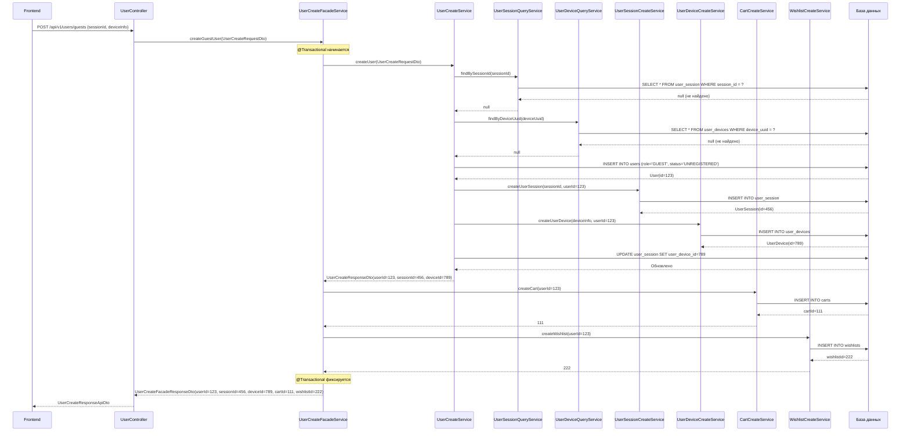
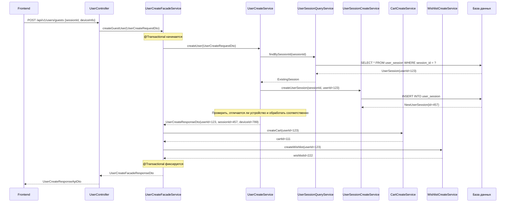

# Аналитика для пользовательской истории: Автоматическая регистрация гостевых пользователей

## 1. Цели

**Бизнес-цель**: Автоматически регистрировать каждого посетителя впервые как гостевого пользователя для обеспечения комплексного отслеживания поведения пользователей и аналитики через единый userId.

**Технические цели**:
- Создать бесшовный пользовательский опыт без требования явной регистрации
- Заложить основу для персонализации и системы рекомендаций
- Обеспечить комплексную аналитику и отслеживание пути пользователя
- Поддерживать целостность данных в корзине, списке желаний и управлении сессиями
- Поддержать будущую конвертацию из гостевого в зарегистрированного пользователя

**Метрики успеха**:
- 100% посетителей впервые получают автоматические пользовательские аккаунты
- Нулевая потеря данных при конвертации гостевого пользователя в зарегистрированного
- Точность отслеживания сессий > 99%
- Среднее время отклика < 500мс для создания гостевого пользователя

## 2. Требования к REST API и валидация

### Спецификация эндпоинта
```http
POST /api/v1/users/guests
Content-Type: application/json
Headers: Опционально (аутентификация не требуется)
```

### Структура Request DTO
```java
public class UserCreateRequestApiDto {
    @NotNull(message = "ID сессии обязателен")
    @Valid
    private UUID sessionId;
    
    @NotNull(message = "Информация об устройстве обязательна")
    @Valid
    private DeviceInfoDto deviceInfo;
}

public class DeviceInfoDto {
    @NotNull(message = "Тип устройства обязателен")
    private DeviceType deviceType; // MOBILE, DESKTOP, TABLET
    
    @NotNull(message = "UUID устройства обязателен")
    private UUID deviceUuid;
    
    @Size(max = 100, message = "Имя устройства не должно превышать 100 символов")
    private String deviceName;
    
    @Size(max = 50, message = "Версия ОС не должна превышать 50 символов")
    private String osVersion;
    
    @Size(max = 50, message = "Имя браузера не должно превышать 50 символов")
    private String browserName;
    
    @Size(max = 50, message = "Версия браузера не должна превышать 50 символов")
    private String browserVersion;
    
    @Min(value = 1, message = "Ширина экрана должна быть положительным числом")
    private Integer screenWidth;
    
    @Min(value = 1, message = "Высота экрана должна быть положительным числом")
    private Integer screenHeight;
    
    @DecimalMin(value = "0.1", message = "Плотность экрана должна быть положительным числом")
    @DecimalMax(value = "10.0", message = "Плотность экрана должна быть разумной")
    private BigDecimal screenDensity;
}
```

### Структура Response DTO
```java
public class UserCreateResponseApiDto {
    private Long userId;
    private Long userSessionId;
    private Long userDeviceId;
    private Long cartId;
    private Long wishlistId;
    private LocalDateTime createdAt;
    private SessionStatus sessionStatus;
}
```

### Правила валидации
- **ID сессии**: Должен быть валидным UUID, не null
- **UUID устройства**: Должен быть валидным UUID, не null
- **Тип устройства**: Должен быть валидным значением enum (MOBILE, DESKTOP, TABLET)
- **Размеры экрана**: Должны быть положительными целыми числами, если предоставлены
- **Строковые поля**: Валидация длины согласно ограничениям базы данных
- **IP адрес**: Автоматически извлекается из запроса, проверяется как валидный IP

### Ответы об ошибках
```json
{
  "error": "VALIDATION_ERROR",
  "message": "Некорректные данные запроса",
  "details": [
    {
      "field": "sessionId",
      "message": "ID сессии обязателен"
    }
  ]
}
```

## 3. Дизайн таблиц базы данных

### Основные таблицы
```sql
-- Таблица пользователей (основная сущность)
CREATE TABLE users (
    id BIGSERIAL PRIMARY KEY,
    first_name VARCHAR(50),
    last_name VARCHAR(50),
    middle_name VARCHAR(50),
    birth_date DATE,
    role VARCHAR(20) NOT NULL DEFAULT 'GUEST',
    status VARCHAR(30) NOT NULL DEFAULT 'UNREGISTERED',
    avatar_url TEXT,
    created_at TIMESTAMP NOT NULL DEFAULT NOW(),
    updated_at TIMESTAMP DEFAULT NOW()
);

-- Таблица пользовательских сессий
CREATE TABLE user_session (
    id BIGSERIAL PRIMARY KEY,
    session_id UUID UNIQUE NOT NULL,
    user_id BIGINT NOT NULL REFERENCES users(id) ON DELETE CASCADE,
    user_device_id BIGINT REFERENCES user_devices(id),
    ip_address INET,
    created_at TIMESTAMP NOT NULL DEFAULT NOW(),
    last_activity_at TIMESTAMP NOT NULL DEFAULT NOW(),
    expires_at TIMESTAMP NOT NULL,
    status VARCHAR(20) NOT NULL DEFAULT 'ACTIVE'
);

-- Таблица устройств пользователей
CREATE TABLE user_devices (
    id BIGSERIAL PRIMARY KEY,
    user_id BIGINT NOT NULL REFERENCES users(id) ON DELETE CASCADE,
    device_type VARCHAR(20) NOT NULL,
    device_uuid UUID UNIQUE,
    device_name VARCHAR(100),
    os_version VARCHAR(50),
    browser_name VARCHAR(50),
    browser_version VARCHAR(50),
    screen_width INTEGER,
    screen_height INTEGER,
    screen_density DECIMAL(4,2),
    push_token TEXT,
    last_seen_at TIMESTAMP,
    created_at TIMESTAMP NOT NULL DEFAULT NOW()
);

-- Таблица корзин (создается CartCreateService)
CREATE TABLE carts (
    id BIGSERIAL PRIMARY KEY,
    user_id BIGINT NOT NULL REFERENCES users(id) ON DELETE CASCADE,
    created_at TIMESTAMP NOT NULL DEFAULT NOW(),
    updated_at TIMESTAMP DEFAULT NOW()
);

-- Таблица списков желаний (создается WishlistCreateService)
CREATE TABLE wishlists (
    id BIGSERIAL PRIMARY KEY,
    user_id BIGINT NOT NULL REFERENCES users(id) ON DELETE CASCADE,
    created_at TIMESTAMP NOT NULL DEFAULT NOW(),
    updated_at TIMESTAMP DEFAULT NOW()
);
```

### Индексы для производительности
```sql
CREATE INDEX idx_user_session_session_id ON user_session(session_id);
CREATE INDEX idx_user_session_user_id ON user_session(user_id);
CREATE INDEX idx_user_session_expires_at ON user_session(expires_at);
CREATE INDEX idx_user_devices_device_uuid ON user_devices(device_uuid);
CREATE INDEX idx_user_devices_user_id ON user_devices(user_id);
CREATE INDEX idx_users_role_status ON users(role, status);
CREATE INDEX idx_carts_user_id ON carts(user_id);
CREATE INDEX idx_wishlists_user_id ON wishlists(user_id);
```

## 4. Псевдокод

```pseudocode
ФУНКЦИЯ createGuestUser(request: UserCreateRequestApiDto) -> UserCreateResponseApiDto
НАЧАЛО
    // 1. Маппинг API DTO во внутренний DTO
    internalRequest = mapApiDtoToInternalDto(request)
    
    // 2. Создание пользователя через фасадный сервис
    userResponse = userCreateFacadeService.createGuestUser(internalRequest)
    
    // 3. Маппинг ответа обратно в API DTO
    apiResponse = mapInternalDtoToApiDto(userResponse)
    
    ВОЗВРАТ apiResponse
КОНЕЦ

ФУНКЦИЯ UserCreateFacadeService.createGuestUser(request: UserCreateRequestDto) -> UserCreateFacadeResponseDto
НАЧАЛО
    НАЧАТЬ ТРАНЗАКЦИЮ
        
        // 1. Создать пользователя с сессией и устройством
        userResult = userCreateService.createUser(request)
        
        // 2. Создать корзину для пользователя
        cartId = cartCreateService.createCart(userResult.userId)
        
        // 3. Создать список желаний для пользователя
        wishlistId = wishlistCreateService.createWishlist(userResult.userId)
        
        // 4. Построить полный ответ
        response = UserCreateFacadeResponseDto.builder()
            .userId(userResult.userId)
            .userSessionId(userResult.userSessionId)
            .userDeviceId(userResult.userDeviceId)
            .cartId(cartId)
            .wishlistId(wishlistId)
            .build()
            
    ЗАФИКСИРОВАТЬ ТРАНЗАКЦИЮ
    
    ВОЗВРАТ response
КОНЕЦ

ФУНКЦИЯ UserCreateService.createUser(request: UserCreateRequestDto) -> UserCreateResponseDto
НАЧАЛО
    sessionId = request.sessionId
    deviceInfo = request.deviceInfo
    
    // 1. Проверить, существует ли сессия
    existingSession = userSessionQueryService.findBySessionId(sessionId)
    
    ЕСЛИ existingSession СУЩЕСТВУЕТ ТО
        // Сессия найдена - создать новую сессию для существующего пользователя
        user = existingSession.user
        newSession = userSessionCreateService.createUserSession(sessionId, user.id)
        
        // Проверить, отличается ли устройство и создать новое устройство при необходимости
        existingDevice = userDeviceQueryService.findByUserIdAndDeviceUuid(user.id, deviceInfo.deviceUuid)
        ЕСЛИ existingDevice НЕ СУЩЕСТВУЕТ ТО
            newDevice = userDeviceCreateService.createUserDevice(deviceInfo, user.id)
            newSession.userDevice = newDevice
        ИНАЧЕ
            newSession.userDevice = existingDevice
        КОНЕЦ ЕСЛИ
        
        ВОЗВРАТ UserCreateResponseDto(user.id, newSession.id, newSession.userDevice.id)
    КОНЕЦ ЕСЛИ
    
    // 2. Проверить, существует ли устройство
    existingDevice = userDeviceQueryService.findByDeviceUuid(deviceInfo.deviceUuid)
    
    ЕСЛИ existingDevice СУЩЕСТВУЕТ ТО
        // Устройство найдено - создать новую сессию для существующего пользователя
        user = existingDevice.user
        newSession = userSessionCreateService.createUserSession(sessionId, user.id)
        newSession.userDevice = existingDevice
        
        ВОЗВРАТ UserCreateResponseDto(user.id, newSession.id, existingDevice.id)
    КОНЕЦ ЕСЛИ
    
    // 3. Создать совершенно нового пользователя, сессию и устройство
    newUser = User.builder()
        .role(UserRole.GUEST)
        .status(UserStatus.UNREGISTERED)
        .build()
    
    savedUser = userRepository.save(newUser)
    
    // 4. Создать пользовательскую сессию
    userSession = userSessionCreateService.createUserSession(sessionId, savedUser.id)
    
    // 5. Создать пользовательское устройство
    userDevice = userDeviceCreateService.createUserDevice(deviceInfo, savedUser.id)
    
    // 6. Связать сессию с устройством
    userSession.userDevice = userDevice
    userSessionRepository.save(userSession)
    
    ВОЗВРАТ UserCreateResponseDto(savedUser.id, userSession.id, userDevice.id)
КОНЕЦ
```

## 5. Диаграммы последовательности

### Основной поток - Создание нового пользователя


### Поток с существующей сессией


## 6. Мониторинг и оповещения

### Ключевые метрики
```yaml
metrics:
  business:
    - guest_user_creation_rate_per_minute # Количество создаваемых гостевых пользователей в минуту
    - guest_to_registered_conversion_rate # Коэффициент конверсии гостевых в зарегистрированных
    - session_duration_avg # Средняя продолжительность сессии
    - device_type_distribution # Распределение типов устройств
    - returning_guest_identification_rate # Коэффициент идентификации возвращающихся гостей
    
  technical:
    - api_response_time_p95 # 95-й перцентиль времени отклика API
    - database_transaction_duration # Продолжительность транзакций БД
    - session_creation_success_rate # Коэффициент успешного создания сессий
    - device_detection_accuracy # Точность определения устройств
    - cache_hit_rate_for_device_lookup # Коэффициент попаданий в кэш для поиска устройств
    
  system:
    - database_connection_pool_usage # Использование пула соединений БД
    - memory_usage_during_bulk_creation # Использование памяти при массовом создании
    - cpu_utilization_during_peak_traffic # Использование CPU в пиковые нагрузки
```

### Конфигурация оповещений
```yaml
alerts:
  critical:
    - name: "High Guest User Creation Failure Rate"
      condition: "error_rate > 5% for 5 minutes"
      action: "immediate_notification"
      
    - name: "Database Transaction Timeout"
      condition: "transaction_duration > 10s"
      action: "immediate_notification"
      
  warning:
    - name: "Slow Guest User Creation"
      condition: "p95_response_time > 1s for 10 minutes"
      action: "team_notification"
      
    - name: "High Session Collision Rate"
      condition: "duplicate_session_rate > 1% for 15 minutes"
      action: "investigation_needed"
      
  info:
    - name: "Peak Traffic Detection"
      condition: "guest_creation_rate > 100/minute"
      action: "scale_notification"
```
### Стратегия логирования
```java
// Ключевые события для логирования
@Service
public class UserCreateService {
    private static final Logger logger = LoggerFactory.getLogger(UserCreateService.class);
    
    public UserCreateResponseDto createUser(UserCreateRequestDto request) {
        logger.info("Началось создание гостевого пользователя для сессии: {}, устройство: {}", 
                   request.getSessionId(), request.getDeviceInfo().getDeviceType());
        
        // Логирование точек принятия решений
        if (existingSession != null) {
            logger.info("Найдена существующая сессия для sessionId: {}, userId: {}", 
                       sessionId, existingSession.getUser().getId());
        }
        
        // Логирование завершения
        logger.info("Гостевой пользователь успешно создан: userId={}, sessionId={}, deviceId={}", 
                   userId, sessionId, deviceId);
    }
}
```

## 7. Риски и возможные проблемы

### Технические риски
1. **Проблемы производительности базы данных**
    - Риск: Высокая одновременная нагрузка создания пользователей, вызывающая блокировки БД
    - Митигация: Реализовать пулы соединений, оптимизировать индексы, использовать реплики для чтения

2. **Коллизии ID сессий**
    - Риск: Коллизия UUID (крайне низкая вероятность)
    - Митигация: Использовать UUID4 с правильной рандомизацией, уникальные ограничения БД

3. **Проблемы отката транзакций**
    - Риск: Частичное создание данных при сбое транзакции
    - Митигация: Правильные границы транзакций, комплексное тестирование откатов

4. **Утечки памяти от информации об устройствах**
    - Риск: Большие объекты информации об устройствах потребляют память
    - Митигация: Реализовать правильное управление жизненным циклом объектов, мониторинг

### Риски бизнес-логики
1. **Дублирование создания пользователей**
    - Риск: Состояние гонки создает нескольких пользователей для одной сессии/устройства
    - Митигация: Уникальные ограничения БД, правильные механизмы блокировки

2. **Недействительная информация об устройстве**
    - Риск: Искаженные или вредоносные данные об устройстве
    - Митигация: Комплексная валидация, санитизация, ограничение частоты запросов

3. **Обработка истечения сессий**
    - Риск: Истекшие сессии не очищаются должным образом
    - Митигация: Фоновые задачи очистки, правильное управление жизненным циклом сессий

### Риски безопасности
1. **Злоупотребление снятием отпечатков устройств**
    - Риск: Злонамеренные акторы манипулируют информацией об устройствах
    - Митигация: Ограничение частоты запросов, обнаружение подозрительной активности

2. **Конфиденциальность IP-адресов**
    - Риск: Хранение персонально идентифицируемых IP-адресов
    - Митигация: Анонимизация IP, меры соответствия GDPR

## 8. Безопасность и ограничения

### Меры защиты данных
```java
// Санитизация ввода
public class DeviceInfoSanitizer {
    public DeviceInfoDto sanitize(DeviceInfoDto deviceInfo) {
        return DeviceInfoDto.builder()
            .deviceType(validateDeviceType(deviceInfo.getDeviceType()))
            .deviceUuid(validateUuid(deviceInfo.getDeviceUuid()))
            .deviceName(sanitizeString(deviceInfo.getDeviceName(), 100))
            .browserName(sanitizeString(deviceInfo.getBrowserName(), 50))
            // ... другие поля
            .build();
    }
    
    private String sanitizeString(String input, int maxLength) {
        if (input == null) return null;
        String sanitized = input.replaceAll("[<>\"'&]", ""); // Удаление потенциального XSS
        return sanitized.length() > maxLength ? 
               sanitized.substring(0, maxLength) : sanitized;
    }
}
```

### Ограничение частоты запросов
```java
@RateLimiting(
    key = "guest-user-creation",
    limit = 100,
    window = "1m",
    keyResolver = IpAddressKeyResolver.class
)
@PostMapping("/api/v1/users/guests")
public ResponseEntity<UserCreateResponseApiDto> createGuestUser(
    @Valid @RequestBody UserCreateRequestApiDto request) {
    // Реализация
}
```

### Политика хранения данных
```yaml
data_retention:
  guest_users:
    inactive_period: "90 days"
    cleanup_policy: "soft_delete"

  sessions:
    expired_sessions: "7 days after expiry"
    cleanup_policy: "hard_delete"

  device_info:
    retention_period: "2 years"
    anonymization: "after 1 year of inactivity"
```

### Ограничения валидации
```java
public class UserCreateRequestApiDto {
    // Предотвращение злоупотреблений через слишком большие запросы
    @Size(max = 36, message = "ID сессии слишком длинный")
    @Pattern(regexp = UUID_PATTERN, message = "Неверный формат ID сессии")
    private UUID sessionId;
    
    @Valid
    @NotNull
    private DeviceInfoDto deviceInfo;
    
    // Ограничение частоты запросов по IP
    @RateLimited(maxRequests = 10, windowSeconds = 60)
    private String clientIpAddress;
}
```

## 9. Критерии приемки

### Функциональные критерии
✅ **AC1: Автоматическое создание пользователя**
- [ ] Когда новый посетитель отправляет запрос с sessionId и deviceInfo, автоматически создается гостевой пользователь
- [ ] Пользователь имеет role='GUEST' и status='UNREGISTERED' по умолчанию
- [ ] Ответ включает userId, userSessionId, userDeviceId, cartId и wishlistId

✅ **AC2: Управление сессиями**
- [ ] Если sessionId уже существует, создается новая сессия для существующего пользователя
- [ ] Если deviceUuid существует, создается новая сессия для владельца устройства
- [ ] Сессия истекает через 24 часа по умолчанию
- [ ] lastActivityAt обновляется при создании сессии

✅ **AC3: Обработка устройств**
- [ ] Информация об устройстве правильно сохраняется и валидируется
- [ ] Разные устройства для одного пользователя обрабатываются корректно
- [ ] Данные отпечатков устройств санитизируются и валидируются

✅ **AC4: Создание связанных данных**
- [ ] Корзина автоматически создается для каждого нового гостевого пользователя
- [ ] Список желаний автоматически создается для каждого нового гостевого пользователя
- [ ] Все операции выполняются в одной транзакции

### Технические критерии
✅ **AC5: Требования к производительности**
- [ ] Время отклика API < 500мс для 95% запросов
- [ ] Обработка 100 одновременных созданий гостевых пользователей без деградации производительности
- [ ] Транзакция базы данных завершается в течение 2 секунд

✅ **AC6: Целостность данных**
- [ ] Все связанные сущности (пользователь, сессия, устройство, корзина, список желаний) создаются атомарно
- [ ] Откат транзакции работает корректно при сбое любого шага
- [ ] Не создаются потерянные записи в случае сбоев

✅ **AC7: Безопасность и валидация**
- [ ] Все входящие данные валидируются согласно определенным ограничениям
- [ ] Вредоносная информация об устройствах правильно санитизируется
- [ ] Ограничение частоты запросов предотвращает злоупотребления (макс. 100 запросов в минуту с IP)
- [ ] IP-адреса правильно обрабатываются и анонимизируются

### Критерии обработки ошибок
✅ **AC8: Ответы об ошибках**
- [ ] Недействительный sessionId возвращает 400 с соответствующим сообщением об ошибке
- [ ] Недействительный deviceInfo возвращает 400 с ошибками валидации по полям
- [ ] Ошибки базы данных возвращают 500 с общим сообщением об ошибке (без раскрытия чувствительных данных)
- [ ] Ошибки таймаута возвращают 408 с рекомендациями по повтору

### Критерии мониторинга
✅ **AC9: Наблюдаемость**
- [ ] Все создания гостевых пользователей логируются с соответствующими уровнями логов
- [ ] Собираются метрики по коэффициентам успеха/неудач, времени отклика и паттернам пользователей
- [ ] Настроены оповещения для высоких коэффициентов ошибок и деградации производительности
- [ ] Запросы к базе данных мониторятся на предмет проблем с производительностью

### Критерии интеграции
✅ **AC10: Интеграция модулей**
- [ ] UserController правильно валидирует API DTO
- [ ] FacadeService корректно координирует все сервисы модулей
- [ ] CartCreateService и WishlistCreateService вызываются с корректным userId
- [ ] MapStruct мапперы корректно конвертируют DTO между слоями
- [ ] Все сервисы следуют принципу единственной ответственности